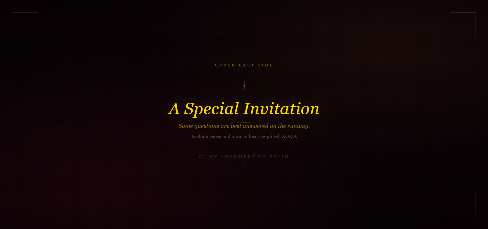
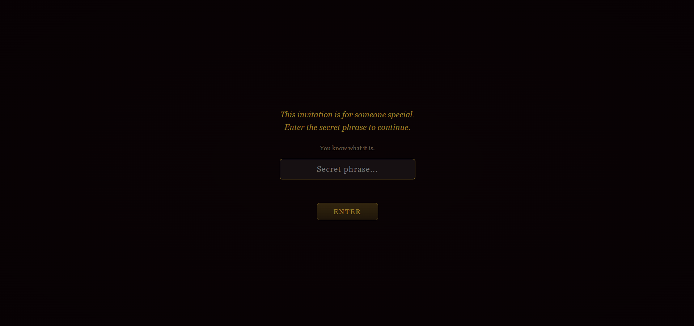
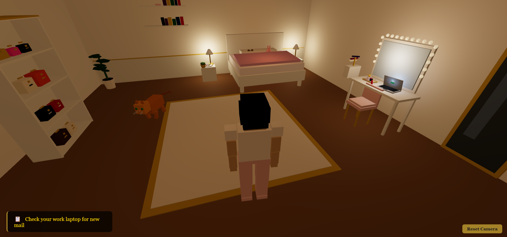
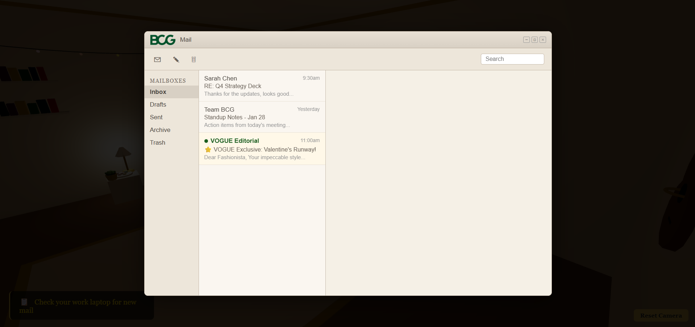
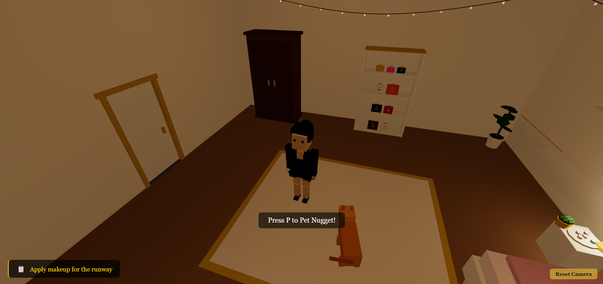
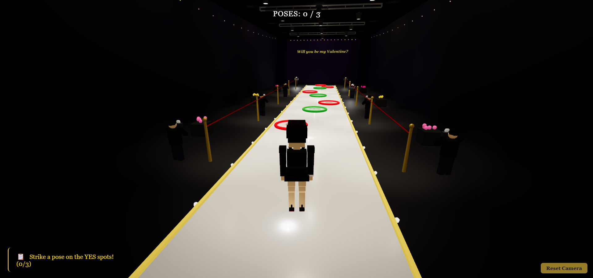
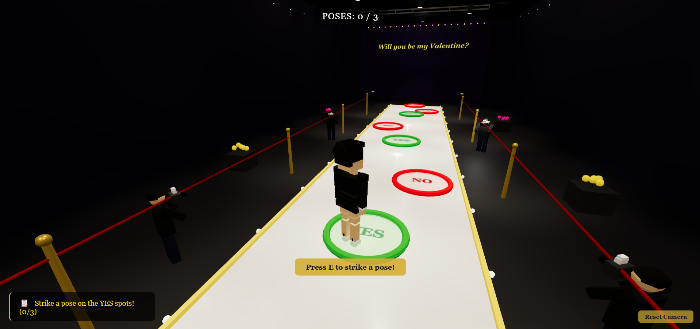
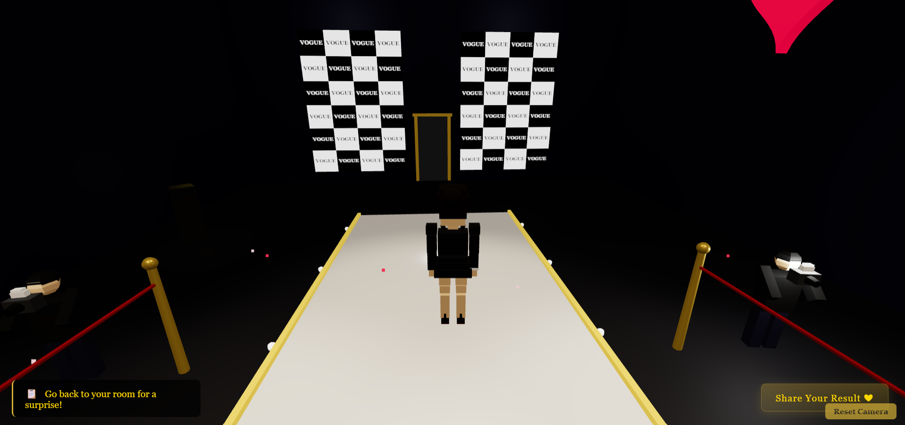
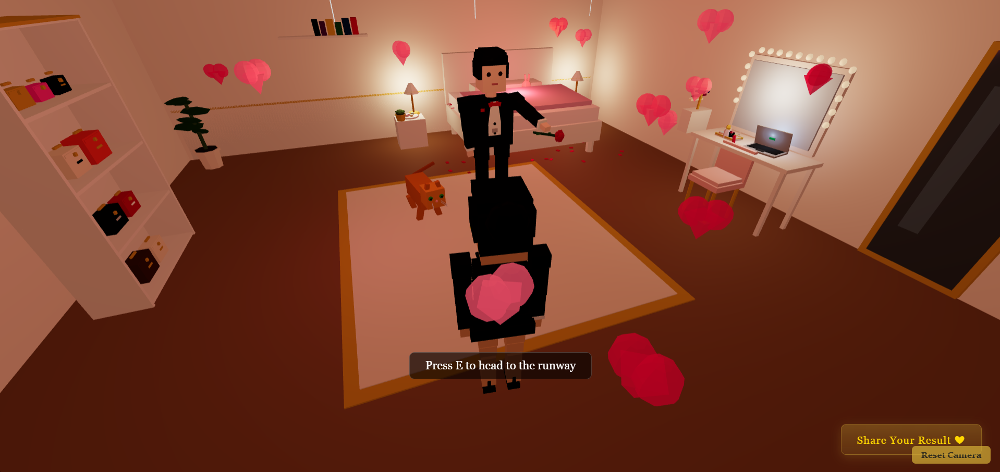

# VDay in NYC

A personalized Valentine's Day experience disguised as a browser-based 3D mini-game, set in a Gossip Girl-inspired Upper East Side world. Walk through a luxury Blair Waldorf-style apartment, step onto a fashion runway, and strike a pose to answer the big question -- with a twist: the "No" spots are impossible to pose on.

**[Live Demo](https://vday-in-nyc-invite.vercel.app)**

## Screenshots











## Game Flow

1. **Secret Passphrase** -- The game opens with a passphrase gate so only the intended recipient can enter
2. **The Apartment** -- Explore a cozy Upper East Side apartment with designer bags, headbands, art deco paintings, a cat, macarons, and more Blair Waldorf-worthy details
3. **The Wardrobe Change** -- Walk through the wardrobe door and your character changes into a runway outfit (LBD, heels with red soles, clutch)
4. **The Runway** -- Enter a fashion show venue complete with VOGUE banners, spotlights, paparazzi cameras, and an audience
5. **Strike a Pose** -- Walk onto gold "YES" or red "NO" pose spots. The "NO" spots dodge away when you get close
6. **Celebration** -- Hit a "YES" spot and confetti, hearts, and a Gossip Girl-style blast announce the answer
7. **The Surprise** -- After celebration, the sender's character appears on the runway for a final scene
8. **Share** -- Send the result via a personalized email invite or copy a shareable link

## Features

- Third-person character controller (WASD / arrow keys + mouse)
- Two fully detailed procedural 3D scenes (apartment + runway)
- Wardrobe transition with outfit change
- Pose spots with dodge mechanics on "NO" spots
- Gossip Girl narration and flirty text overlays
- Confetti, hearts, and particle celebration effects
- Personalized email invite system
- Telegram notification on "Yes" response
- Mobile touch controls with virtual joystick
- Fully client-side -- no backend required

## Tech Stack

- **3D Engine**: [Three.js](https://threejs.org/) -- all geometry is procedurally generated (no external 3D models)
- **Build Tool**: [Vite](https://vitejs.dev/)
- **Language**: JavaScript (ES modules)
- **Hosting**: [Vercel](https://vercel.com/)
- **Notifications**: Telegram Bot API (via environment variables)

## Getting Started

### Prerequisites

- Node.js 18+
- npm

### Installation

```bash
git clone https://github.com/yugenflow/vday-invite-gossip-girl.git
cd vday-invite-gossip-girl
npm install
```

### Environment Variables

Create a `.env.local` file in the project root:

```env
# Personalization -- customize for your Valentine
VITE_SENDER_NAME=YourName
VITE_RECIPIENT_NAME=TheirFirstName
VITE_RECIPIENT_PETNAME=TheirNickname
VITE_RECIPIENT_FULL_NAME=Their Full Name

# Secret passphrase the recipient must enter to start the game
VITE_SECRET_KEY=YourSecretPhrase

# Runway banner text
VITE_BANNER_TEXT=Will you be my Valentine?

# Telegram notifications (optional)
VITE_TELEGRAM_BOT_TOKEN=your_telegram_bot_token
VITE_TELEGRAM_CHAT_ID=your_telegram_chat_id
```

Telegram credentials are optional -- the app works without them, but notifications won't fire.

## Customization Guide

Everything personal to the two people is configured via environment variables and one text file. **No code changes needed.**

### Names

| Variable | What it controls | Example |
|---|---|---|
| `VITE_SENDER_NAME` | Your name -- celebration text, flirty texts, GG narration, Telegram alerts | `Prateek` |
| `VITE_RECIPIENT_NAME` | Their first name -- Telegram notifications | `Akshita` |
| `VITE_RECIPIENT_PETNAME` | Their nickname -- dodge messages, flirty texts, celebration text, Gossip Girl blast | `Cutakshita` |
| `VITE_RECIPIENT_FULL_NAME` | Their full name -- GG narration, auto-generates the name puzzle hint in the guidelines | `Akshita Sharma` |

**Where each name shows up:**

- **Celebration screen**: "Spotted: `PETNAME` has a very special plan coming her way from `SENDER`"
- **Gossip Girl narration**: "`FULL_NAME` saying YES to being `SENDER`'s Valentine"
- **Dodge messages**: "Nuh uh, `PETNAME`!"
- **Flirty texts**: "Vogue-worthy, `PETNAME`!" / "`SENDER` is one lucky guy"
- **Gossip Girl blast** (runway guidelines): "A certain `PETNAME` entering a private fashion studio..."
- **Name puzzle**: Auto-generated from `FULL_NAME` (e.g. "Akshita Sharma" becomes `A _ _ _ _ _ _ S _ _ _ _ A`)
- **Telegram notifications**: "`PETNAME` has entered her room" / "`RECIPIENT` struck all 3 poses!"

### Secret Passphrase

| Variable | What it controls | Example |
|---|---|---|
| `VITE_SECRET_KEY` | The passphrase the recipient must type on the start screen to enter the game | `ThisIsTheSecret` |

### Runway Banner

| Variable | What it controls | Example |
|---|---|---|
| `VITE_BANNER_TEXT` | The big question displayed on the runway backdrop | `Will you be my Valentine?` |

### Gossip Girl Blast (Runway Guidelines)

The file `gossipgirlblast.txt` in the project root contains the Gossip Girl-themed guidelines shown when the player enters the runway. Edit this file directly to change the text.

- `{{PETNAME}}` is automatically replaced with your `VITE_RECIPIENT_PETNAME` value
- `{{NAME_HINT}}` is automatically replaced with an auto-generated name puzzle from `VITE_RECIPIENT_FULL_NAME`
- Everything else (rules, food references, tone) can be freely edited

### Telegram Notifications

To get notified on your phone when the recipient plays:

1. Create a Telegram bot via [@BotFather](https://t.me/botfather) and get the token
2. Get your chat ID by messaging [@userinfobot](https://t.me/userinfobot)
3. Set `VITE_TELEGRAM_BOT_TOKEN` and `VITE_TELEGRAM_CHAT_ID`

Three notifications are sent: when they enter the apartment, when they complete all poses, and a celebration message.

### For Production (Vercel)

Set the same `VITE_*` variables in your Vercel project dashboard under **Settings > Environment Variables**, then redeploy.

### Development

```bash
npm run dev
```

Opens at `http://localhost:3004`.

### Production Build

```bash
npm run build
npm run preview
```

## Deployment

The project is deployed on Vercel. Push to the `master` branch to trigger automatic deployment.

To deploy manually:

```bash
npx vercel --prod
```

## Project Structure

```
├── index.html              # Entry point with embedded styles and UI containers
├── gossipgirlblast.txt     # Gossip Girl blast text (editable)
├── src/
│   ├── main.js             # App initialization and game loop
│   ├── config.js            # All personalization config (env vars)
│   ├── constants.js        # Colors, dimensions, messages
│   ├── character/          # Character models and animations
│   ├── controls/           # Third-person controller + mobile controls
│   ├── scenes/             # Apartment and Runway scene builders
│   ├── props/              # All 3D props (furniture, bags, cat, runway items...)
│   ├── state/              # Game state machine
│   ├── systems/            # Celebration, interaction, pose, dodge systems
│   └── ui/                 # Overlay UIs (guidelines, celebration, email, HUD)
├── public/                 # Static assets
├── vite.config.js          # Vite configuration
├── vercel.json             # Vercel deployment config
└── package.json
```

## License

This is a personal project, not intended for redistribution.
